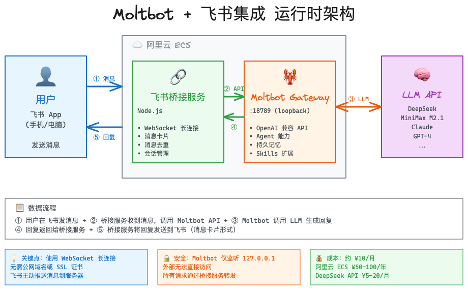

# Moltbot + 飞书集成部署 SOP

> 本文档记录了将 Moltbot 部署到阿里云 ECS 并集成飞书机器人的完整流程。

## 整体架构



**核心组件：**
- **用户** - 通过飞书 App（手机/电脑）发送消息
- **飞书桥接服务** - Node.js 服务，使用 WebSocket 长连接接收飞书消息
- **Moltbot Gateway** - AI Agent 核心，监听 127.0.0.1:18789
- **LLM API** - DeepSeek / MiniMax / Claude 等大语言模型

**数据流程：**
1. 用户在飞书中发送消息给机器人
2. 飞书通过长连接将消息推送到桥接服务
3. 桥接服务调用 Moltbot 的 OpenAI 兼容 API
4. Moltbot 调用 LLM 生成回复
5. 桥接服务将回复以消息卡片形式发送回飞书

---

## 第一部分：服务器环境准备

### 1.1 系统要求

- 操作系统：阿里云 Linux 3 / CentOS 7+ / Ubuntu 20.04+
- 内存：建议 2GB+
- Node.js：22+（Moltbot CLI 官方要求）

### 1.2 安装 Node.js 22+

**阿里云 Linux / CentOS：**
```bash
curl -fsSL https://rpm.nodesource.com/setup_22.x | sudo -E bash -
sudo yum install -y nodejs
```

**Ubuntu/Debian：**
```bash
curl -fsSL https://deb.nodesource.com/setup_22.x | sudo -E bash -
sudo apt-get install -y nodejs
```

**验证安装：**
```bash
node -v  # 应显示 v22.x.x
npm -v
```

### 1.3 配置 Git 使用 HTTPS

Moltbot 的某些依赖需要从 GitHub 拉取，配置 HTTPS 避免 SSH 权限问题：

```bash
git config --global url."https://github.com/".insteadOf ssh://git@github.com/
git config --global url."https://github.com/".insteadOf git@github.com:
```

### 1.4 安装 Moltbot CLI

```bash
sudo npm i -g clawdbot@latest

# 验证
clawdbot --version
```

---

## 第二部分：Moltbot 配置

### 2.1 创建配置目录

```bash
mkdir -p ~/.clawdbot
```

### 2.2 创建配置文件

创建 `~/.clawdbot/moltbot.json`：

```json
{
  "gateway": {
    "mode": "local",
    "bind": "loopback",
    "auth": {
      "mode": "token",
      "token": "生成一个随机token，如: openssl rand -hex 16"
    },
    "http": {
      "endpoints": {
        "chatCompletions": {
          "enabled": true
        }
      }
    }
  },
  "agents": {
    "defaults": {
      "model": {
        "primary": "deepseek/deepseek-chat",
        "fallbacks": ["minimax/MiniMax-M2.1"]
      }
    }
  },
  "models": {
    "mode": "merge",
    "providers": {
      "deepseek": {
        "baseUrl": "https://api.deepseek.com/v1",
        "apiKey": "${DEEPSEEK_API_KEY}",
        "api": "openai-completions",
        "models": [
          { "id": "deepseek-chat", "name": "DeepSeek Chat" },
          { "id": "deepseek-reasoner", "name": "DeepSeek Reasoner" }
        ]
      },
      "minimax": {
        "baseUrl": "https://api.minimax.io/anthropic",
        "apiKey": "${MINIMAX_API_KEY}",
        "api": "anthropic-messages",
        "models": [
          {
            "id": "MiniMax-M2.1",
            "name": "MiniMax M2.1",
            "reasoning": false,
            "input": ["text"],
            "cost": { "input": 15, "output": 60, "cacheRead": 2, "cacheWrite": 10 },
            "contextWindow": 200000,
            "maxTokens": 8192
          }
        ]
      }
    }
  },
  "hooks": {
    "enabled": true,
    "token": "feishu-bridge-secret-token",
    "path": "/hooks"
  }
}
```

**配置说明：**
- `gateway.auth.token`：用于 API 认证，请生成随机值
- `agents.defaults.model.primary`：主要使用的 LLM 模型
- `models.providers`：配置各 LLM 提供商的 API

### 2.3 创建环境变量文件

创建 `~/.clawdbot/.env`：

```bash
# LLM API Keys
DEEPSEEK_API_KEY=sk-你的DeepSeek密钥
MINIMAX_API_KEY=sk-你的MiniMax密钥
```

设置权限：
```bash
chmod 600 ~/.clawdbot/.env
```

### 2.4 创建 Moltbot systemd 服务

```bash
mkdir -p ~/.config/systemd/user

cat > ~/.config/systemd/user/moltbot.service << 'EOF'
[Unit]
Description=Moltbot Gateway
After=network.target

[Service]
Type=simple
Environment=HOME=/home/admin
Environment=NODE_ENV=production
EnvironmentFile=-/home/admin/.clawdbot/.env
ExecStart=/usr/bin/clawdbot gateway
Restart=on-failure
RestartSec=10

[Install]
WantedBy=default.target
EOF
```

> **注意**：将 `/home/admin` 替换为你的实际用户目录。

### 2.5 启动 Moltbot 服务

```bash
# 重载 systemd 配置
systemctl --user daemon-reload

# 启用开机自启
systemctl --user enable moltbot.service

# 启动服务
systemctl --user start moltbot.service

# 让服务在用户未登录时也运行
loginctl enable-linger $(whoami)

# 检查状态
systemctl --user status moltbot.service
```

### 2.6 验证 Moltbot 运行

```bash
# 测试 API
curl -s http://127.0.0.1:18789/v1/chat/completions \
  -H "Authorization: Bearer 你的gateway-token" \
  -H "Content-Type: application/json" \
  -d '{"model":"moltbot","messages":[{"role":"user","content":"你好"}]}'
```

---

## 第三部分：飞书桥接服务

### 3.1 创建项目目录

```bash
mkdir -p ~/feishu-bridge
cd ~/feishu-bridge
```

### 3.2 创建 package.json

```json
{
  "name": "feishu-moltbot-bridge",
  "version": "1.0.0",
  "description": "Bridge between Feishu and Moltbot",
  "main": "index.js",
  "type": "module",
  "scripts": {
    "start": "node index.js"
  },
  "dependencies": {
    "@larksuiteoapi/node-sdk": "^1.35.0"
  }
}
```

### 3.3 创建 index.js

```javascript
import * as lark from "@larksuiteoapi/node-sdk";

// ========== 配置 ==========
const FEISHU_APP_ID = process.env.FEISHU_APP_ID;
const FEISHU_APP_SECRET = process.env.FEISHU_APP_SECRET;
const CLAWDBOT_URL = process.env.CLAWDBOT_URL || "http://127.0.0.1:18789";
const CLAWDBOT_TOKEN = process.env.CLAWDBOT_TOKEN;

if (!FEISHU_APP_ID || !FEISHU_APP_SECRET) {
  console.error("请设置环境变量 FEISHU_APP_ID 和 FEISHU_APP_SECRET");
  process.exit(1);
}

// 用户会话存储
const userSessions = new Map();
// 已处理消息（防重复）
const processedMessages = new Set();

// 飞书客户端
const client = new lark.Client({
  appId: FEISHU_APP_ID,
  appSecret: FEISHU_APP_SECRET,
  disableTokenCache: false,
});

// 创建消息卡片
function createCard(content, isThinking = false) {
  return JSON.stringify({
    config: { wide_screen_mode: true },
    header: {
      template: isThinking ? "yellow" : "blue",
      title: {
        tag: "plain_text",
        content: isThinking ? "🤔 正在思考..." : "💬 回复"
      }
    },
    elements: [{ tag: "markdown", content }]
  });
}

// 发送卡片消息
async function sendCard(chatId, content, isThinking = false) {
  try {
    const res = await client.im.message.create({
      params: { receive_id_type: "chat_id" },
      data: {
        receive_id: chatId,
        msg_type: "interactive",
        content: createCard(content, isThinking),
      },
    });
    return res.data?.message_id;
  } catch (error) {
    console.error("Failed to send card:", error.message);
    return null;
  }
}

// 更新卡片消息
async function updateCard(messageId, content) {
  try {
    await client.im.message.patch({
      path: { message_id: messageId },
      data: { content: createCard(content, false) },
    });
    return true;
  } catch (error) {
    console.error("Failed to update card:", error.message);
    return false;
  }
}

// 调用 Moltbot API 获取回复
async function getMoltbotResponse(userId, userMessage) {
  if (!userSessions.has(userId)) {
    userSessions.set(userId, []);
  }
  const history = userSessions.get(userId);
  
  history.push({ role: "user", content: userMessage });
  
  // 只保留最近 20 条消息
  if (history.length > 20) {
    history.splice(0, history.length - 20);
  }

  try {
    const response = await fetch(`${CLAWDBOT_URL}/v1/chat/completions`, {
      method: "POST",
      headers: {
        "Content-Type": "application/json",
        "Authorization": `Bearer ${CLAWDBOT_TOKEN}`,
        "x-moltbot-agent-id": "main",
      },
      body: JSON.stringify({
        model: "moltbot",
        messages: history,
        user: `feishu:${userId}`,
      }),
    });

    if (!response.ok) {
      const errorText = await response.text();
      console.error("Moltbot API error:", response.status, errorText);
      return `抱歉，出现了错误 (${response.status})`;
    }

    const data = await response.json();
    const assistantMessage = data.choices?.[0]?.message?.content || "抱歉，没有获取到回复";
    
    history.push({ role: "assistant", content: assistantMessage });
    
    return assistantMessage;
  } catch (error) {
    console.error("Moltbot request error:", error);
    return `抱歉，请求失败: ${error.message}`;
  }
}

// 清理过期消息ID
function cleanupProcessedMessages() {
  if (processedMessages.size > 1000) {
    const arr = Array.from(processedMessages);
    arr.slice(0, arr.length - 500).forEach(id => processedMessages.delete(id));
  }
}

// 事件分发器
const eventDispatcher = new lark.EventDispatcher({}).register({
  "im.message.receive_v1": async (data) => {
    const message = data.message;
    const messageId = message.message_id;
    
    // 去重检查（飞书超时会重发消息）
    if (processedMessages.has(messageId)) {
      console.log(`Duplicate message ignored: ${messageId}`);
      return;
    }
    processedMessages.add(messageId);
    cleanupProcessedMessages();
    
    // 只处理文本消息
    if (message.message_type !== "text") {
      return;
    }
    
    let userText = "";
    try {
      userText = JSON.parse(message.content).text || "";
    } catch (e) {
      return;
    }
    
    if (!userText.trim()) {
      return;
    }
    
    const userId = data.sender?.sender_id?.open_id || "unknown";
    const chatId = message.chat_id;
    console.log(`[${messageId}] User: ${userText}`);
    
    // 1. 发送"正在思考..."卡片
    const thinkingMsgId = await sendCard(chatId, "请稍候，正在为您生成回复...", true);
    
    // 2. 获取 Moltbot 回复
    const reply = await getMoltbotResponse(userId, userText);
    
    // 3. 更新卡片为实际回复
    if (thinkingMsgId) {
      const updated = await updateCard(thinkingMsgId, reply);
      if (!updated) {
        await sendCard(chatId, reply, false);
      }
    } else {
      await sendCard(chatId, reply, false);
    }
    console.log(`[${messageId}] Done`);
  },
});

// 使用长连接方式接收事件
const wsClient = new lark.WSClient({
  appId: FEISHU_APP_ID,
  appSecret: FEISHU_APP_SECRET,
  loggerLevel: lark.LoggerLevel.info,
});

console.log("Starting Feishu-Moltbot bridge...");
console.log(`Moltbot URL: ${CLAWDBOT_URL}`);

wsClient.start({
  eventDispatcher: eventDispatcher,
});

console.log("WebSocket client started, waiting for messages...");
```

### 3.4 创建环境变量文件

创建 `~/feishu-bridge/.env`：

```bash
# 飞书应用凭证（从飞书开放平台获取）
FEISHU_APP_ID=cli_xxxxxxxxxxxxxxxx
FEISHU_APP_SECRET=xxxxxxxxxxxxxxxxxxxxxxxxxxxxxxxx

# Moltbot 配置
CLAWDBOT_URL=http://127.0.0.1:18789
CLAWDBOT_TOKEN=你的moltbot-gateway-token
```

设置权限：
```bash
chmod 600 ~/feishu-bridge/.env
```

### 3.5 安装依赖

```bash
cd ~/feishu-bridge
npm install
```

### 3.6 创建 systemd 服务

```bash
cat > ~/.config/systemd/user/feishu-bridge.service << 'EOF'
[Unit]
Description=Feishu-Moltbot Bridge
After=network.target moltbot.service

[Service]
Type=simple
Environment=HOME=/home/admin
EnvironmentFile=/home/admin/feishu-bridge/.env
WorkingDirectory=/home/admin/feishu-bridge
ExecStart=/usr/bin/node index.js
Restart=on-failure
RestartSec=10

[Install]
WantedBy=default.target
EOF
```

> **注意**：将 `/home/admin` 替换为你的实际用户目录。

### 3.7 启动飞书桥接服务

```bash
systemctl --user daemon-reload
systemctl --user enable feishu-bridge.service
systemctl --user start feishu-bridge.service

# 检查状态
systemctl --user status feishu-bridge.service
```

---

## 第四部分：飞书开放平台配置

### 4.1 创建应用

1. 访问 [飞书开放平台](https://open.feishu.cn/app)
2. 点击「创建企业自建应用」
3. 填写应用名称和描述
4. 创建后，记录 **App ID** 和 **App Secret**

### 4.2 添加机器人能力

1. 进入应用详情
2. 点击「添加应用能力」
3. 选择「机器人」并添加

### 4.3 配置权限

在「权限管理」中添加以下权限：

| 权限 | 说明 |
|------|------|
| `im:message` | 获取与发送单聊、群组消息 |
| `im:message.p2p_msg:readonly` | 读取用户发给机器人的单聊消息 |
| `im:message:send_as_bot` | 以应用的身份发消息 |

### 4.4 配置事件订阅

1. 进入「事件与回调」
2. 选择「使用长连接接收事件」（推荐）
3. 点击「保存」（需要先启动桥接服务建立连接）
4. 点击「添加事件」，添加 `im.message.receive_v1`

### 4.5 发布应用

1. 进入「版本管理与发布」
2. 点击「创建版本」
3. 填写版本号和更新说明
4. 提交发布

企业自建应用通常会自动通过审核。

### 4.6 使用机器人

发布后，在飞书中搜索你的机器人名称，即可开始对话。

---

## 第五部分：运维指南

### 5.1 常用命令

```bash
# ===== Moltbot 服务 =====
# 查看状态
systemctl --user status moltbot.service

# 查看日志
journalctl --user -u moltbot.service -f

# 重启服务
systemctl --user restart moltbot.service

# 停止服务
systemctl --user stop moltbot.service


# ===== 飞书桥接服务 =====
# 查看状态
systemctl --user status feishu-bridge.service

# 查看日志
journalctl --user -u feishu-bridge.service -f

# 重启服务
systemctl --user restart feishu-bridge.service

# 停止服务
systemctl --user stop feishu-bridge.service
```

### 5.2 测试 Moltbot API

```bash
curl -s http://127.0.0.1:18789/v1/chat/completions \
  -H "Authorization: Bearer 你的token" \
  -H "Content-Type: application/json" \
  -d '{"model":"moltbot","messages":[{"role":"user","content":"你好"}]}' | jq
```

### 5.3 本地访问 Control UI

通过 SSH 隧道访问 Moltbot 的 Web 界面：

```bash
# 在本地执行
ssh -N -L 18789:127.0.0.1:18789 用户名@服务器IP

# 然后在浏览器打开
# http://127.0.0.1:18789/?token=你的gateway-token
```

### 5.4 更新 Moltbot

```bash
sudo npm i -g clawdbot@latest
systemctl --user restart moltbot.service
```

---

## 第六部分：关键文件位置

| 文件 | 路径 | 说明 |
|------|------|------|
| Moltbot 配置 | `~/.clawdbot/moltbot.json` | Gateway 和模型配置 |
| Moltbot 环境变量 | `~/.clawdbot/.env` | API Keys |
| Moltbot 服务 | `~/.config/systemd/user/moltbot.service` | systemd 服务定义 |
| Moltbot 日志 | `/tmp/moltbot/moltbot-*.log` | 运行日志 |
| 飞书桥接代码 | `~/feishu-bridge/index.js` | 桥接服务源码 |
| 飞书桥接环境变量 | `~/feishu-bridge/.env` | 飞书凭证 |
| 飞书桥接服务 | `~/.config/systemd/user/feishu-bridge.service` | systemd 服务定义 |

---

## 第七部分：故障排除

### 问题：飞书收不到回复

1. 检查桥接服务状态：
   ```bash
   systemctl --user status feishu-bridge.service
   journalctl --user -u feishu-bridge.service -n 50
   ```

2. 检查 Moltbot 服务状态：
   ```bash
   systemctl --user status moltbot.service
   ```

3. 测试 Moltbot API 是否正常：
   ```bash
   curl http://127.0.0.1:18789/health
   ```

### 问题：收到重复回复

这是飞书的重试机制导致的。确保桥接服务代码中包含消息去重逻辑（`processedMessages` Set）。

### 问题：回复太慢

- 考虑使用更快的模型（如 `deepseek-chat`）
- 检查网络到 LLM API 的延迟
- 减少会话历史长度

### 问题：长连接断开

服务会自动重连。如果频繁断开，检查：
- 网络稳定性
- 飞书应用配置是否正确

---

## 附录：生成随机 Token

```bash
# 生成 32 字符的随机 token
openssl rand -hex 16
```

---

*文档更新日期：2026-01-27*
